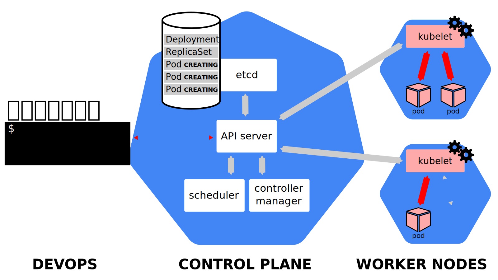
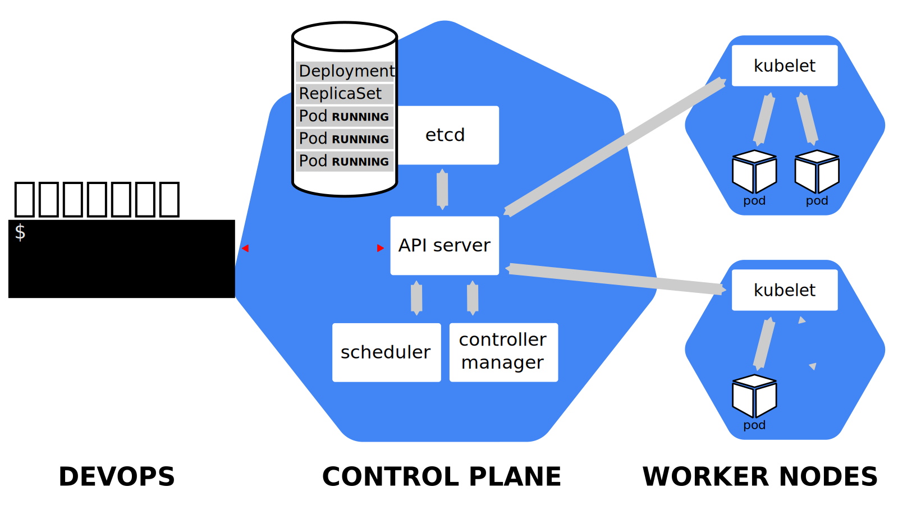

Brief summary of how the kubernetes micro-services work together on an API call:

! For a more complete overview visit: https://slides.kubernetesmastery.com/#231

---

`kubectl expose` creates a *service* for existing pods. A *service* is just a stable address for one or more pods.

If we want to connect to our pod(s), we need to create a *service*. Once a service is created, CoreDNS will allow us to resolve it by name.

There are different types of services: `ClusterIP`, `NodePort`, `LoadBalancer`, `ExternalName`.

---

`ClusterIP` (default type)

- A virtual IP address is allocated for the service (in an internal, private range)
- This IP address is reachable only from within the cluster (nodes and pods)
- Our code can connect to the service using the original port number

`NodePort` 

- A port allocated for the service (by default, in the 30000-32768 range)
- That port is made available on *all our nodes* and anybody can connect to it
- Our code must be changed to connect to that new port number

These are constrolled by `kube-proxy` which is using a userland proxy and a bunch of `iptables` rules.

`LoadBalancer`

- An external load balancer is allocated for the service
- It's available only when the underlying infrastructure provides some "load balancer as a service" (e.g. AWS, Azure, GCE, OpenStack..)
- The load balancer is configured accordingly (e.g. a `NodePort` service is created, and the load balancer sends traffic to that port)

`ExternalName`

- The DNS entry managed by CoreDNS will just be a `CNAME` to a provided record
- No port, no IP address, no nothing else is allocated

---

In order to watch the pods in a log like fashion use the `-w` flag: `kubectl get pods -w` 

`kubectl expose deployment httpenv --port 8888` will create that in the IP tables, using the deployment command to single out the specific pods which it will affect.

`kubectl get service`

---

You can assign IP addresses to services, but they are still *layer 4* (i.e. a servicce is not an IP address; it's an IP address + protocol + port). This is cause by the current implementation of `kube-proxy`.

As a result, you *have to* indicate the port number for your service.

