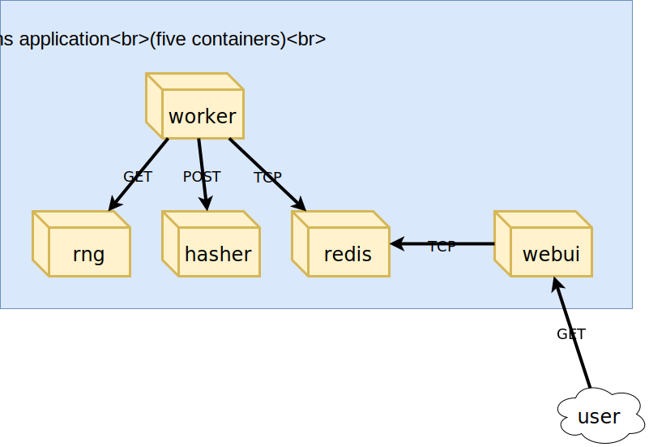

Running DockerCoins on Kubernetes

Deploy `redis`:

`kubectl create deployment redis --image=redis`

Deploy everyhing else:

```
kubectl create deployment hasher --image=dockercoins/hasher:v0.1
kubectl create deployment rng --image=dockercoins/rng:v0.1
kubectl create deployment webui --image=dockercoins/webui:v0.1
kubectl create deployment worker --image=dockercoins/worker:v0.1
```

---

Worker will the crash because the ports are not exposed, therefore the deployments are not reachable.

```
kubectl expose deployment redis --port 6379 
kubectl expose deployment rng --port 80 
kubectl expose deployment hasher --port 80
```

---

The Web UI needs to be accessible outside the cluster, therefore we can use `NodePort` for external access:

`kubectl expose deploy/webui --type=NodePort --port=80`

`kubectl get svc` to check if it was allocated. 

If you are using minikube you will have to get the internal IP of it: `kubectl get nodes -o wide` and then use that with the `webui` allocated port. 

---

Scaling the demo app



The loop is done in the worker - so adding more workers might up the 4 hashes/s rate.

`kubectl scale deployment worker --replicas=2`

When we scale it at 10 replicas - our hashes peak at 10 hashes/s.

---

Benchmarking the service

We can use `httping` (it's just like `ping`, but using HTTP `GET` requests) in order to benchmark `hasher` and `rng`.

First, we need the IP addresses of the `hasher` and `rng`:
```
HASHER=$(kubectl get svc hasher -o go-template={{.spec.clusterIP}})
RNG=$(kubectl get svc rng -o go-template={{.spec.clusterIP}})
```

We could get those IP's with `kubectl get services`, but it's more convinient to get them in a programatic way imo.

---

`httping -c 3 $HASHER` and `httping -c 3 $RNG` to test this out. 

---


